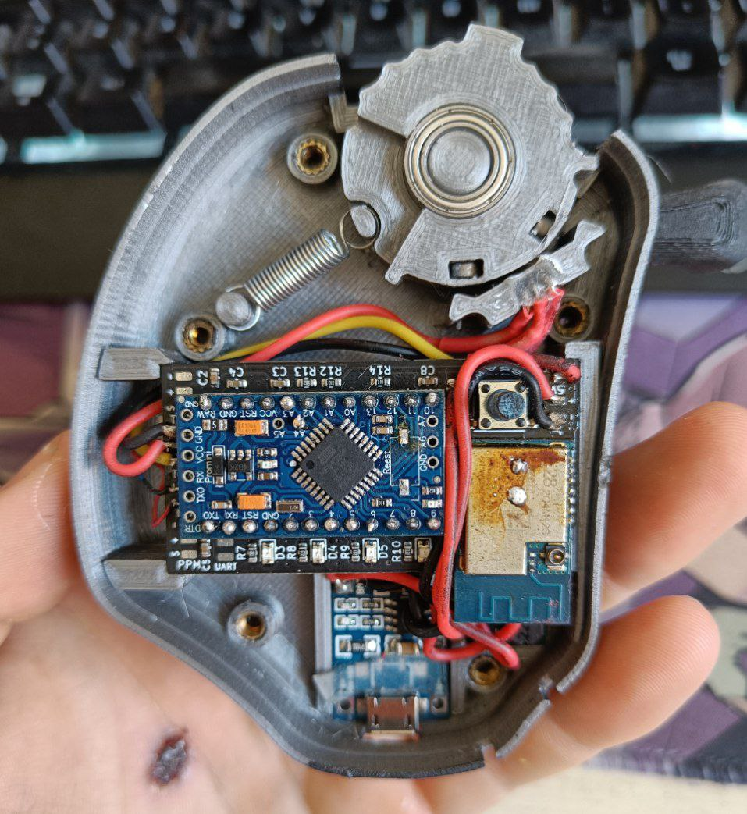
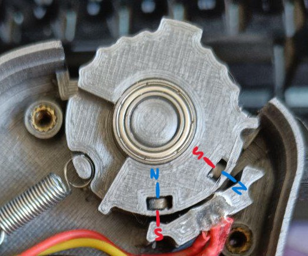

# Assembly

## 3D printing a case

It is recommended to print the remote case in a plastic meant for mechanical parts and capable of resisting some level of impact:

* PETG
* ABS
* Nylon
* ASA

I have personally tested PETG with great results, specially at 0.12mm layer height. 

## Putting it all together

The official cases have cutouts and walls designed to make sure every component is supported and doesn't move during operation. It is still recommended to secure them using double-sided sticky tape. As reference, a completely assembled round version is depicted below:

## Moving parts

Triggers and thumbwheels are mounted on press fit ball bearings. If your printer tolerances are way off, a little bit of PTFE tape can be used to ensure a snug fit. The spring will be a little too tight when first assembled and also he friction will probably make it not return to center easily and completely. It is recommended to lube the cut where the spring is secured to the thumbwheel/trigger to ensure consistent centering, but a little bit of use will probably take care of it anyways.

## Sensor and magnets

For the thumbwheel versions make sure the magnets are configured facing opposite poles as follows: 

It is ***NOT*** important which is the actual north or south pole of each magnet, ***JUST*** that they face opposite directions. The easiest way to accomplish this is to insert one of them and then make sure that it tries to *repel* the other one if you place it on the ouside of the wheel next to the already inserted one. 

Dual trigger version doesn't care about magnet orientation as they're two separate sensors that only use the unidirectional throw.

## **IMPORTANT**

Both the magnets and sensor should be glued in place once the setup is verified and working. Superglue or epoxy recommended.

## Inserts

The official cases use brass inserts to ensure the remote is closed up properly. They should be heated using a lighter and placed in the provided anchor points.