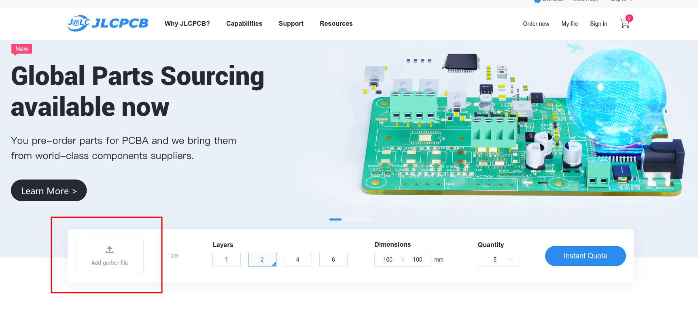
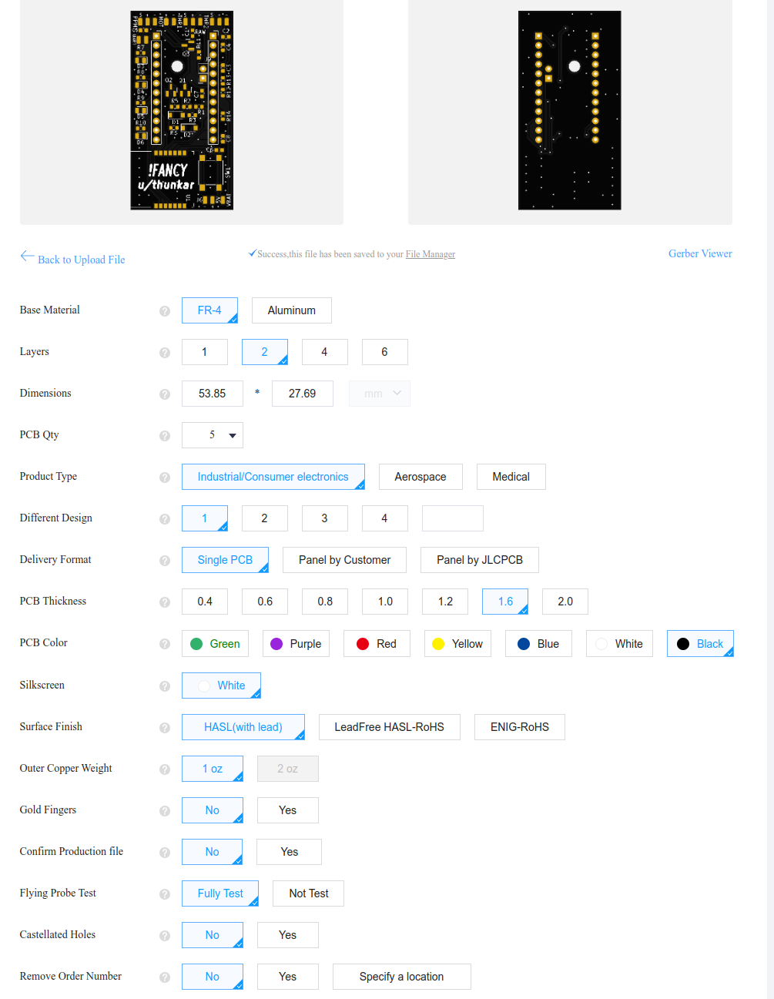
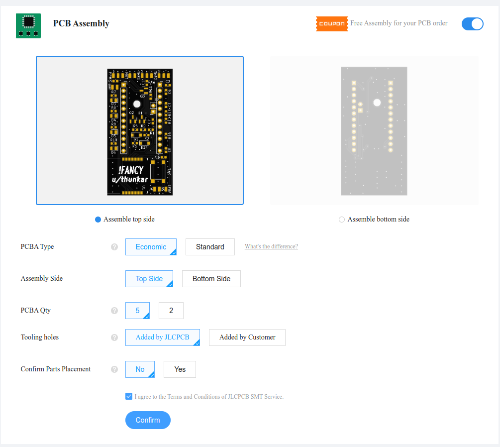
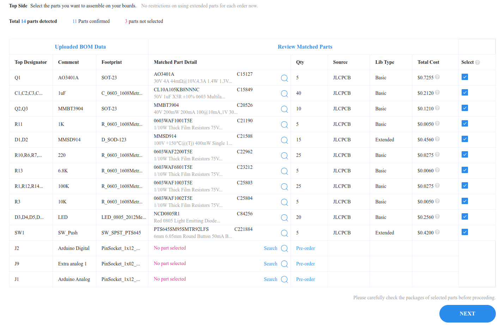
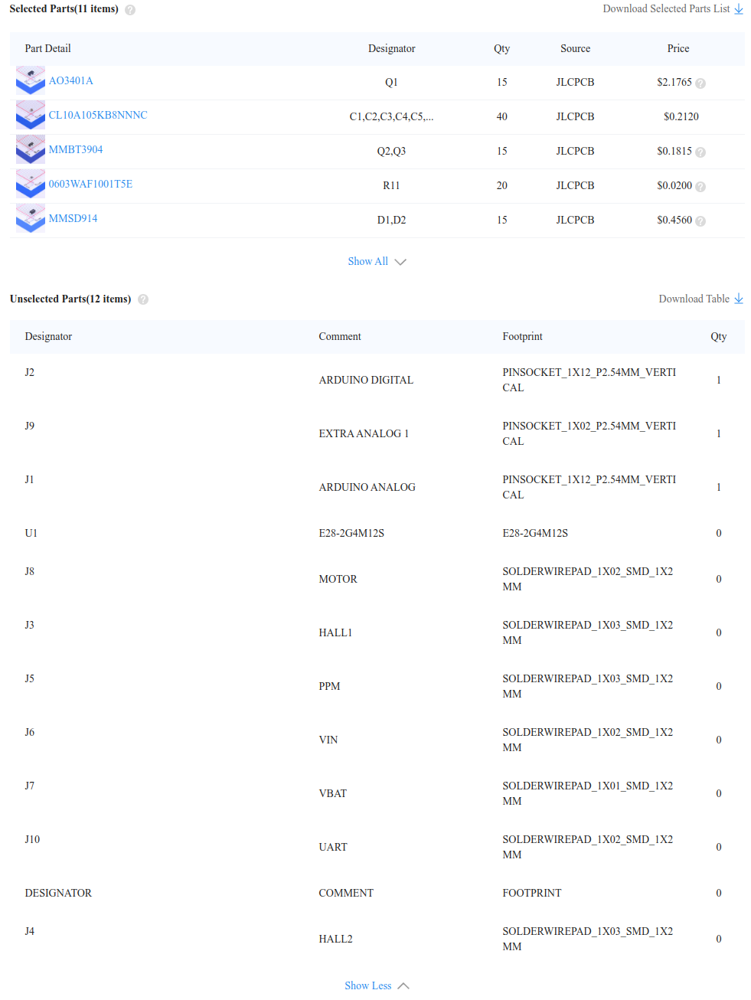

# Ordering

## PCBs

Ordering from [JLCPCB](https://jlcpcb.com/) is very easy. First of all, make sure you have successfully downloaded or cloned this repository in your computer, and have unzipped the contents. The first step is to go to the website and click on 'Add gerber file':

Then navigate to `hardware/jlcpcb/gerber` and select `GERBER-unfancyRemote.zip`. These are the design files for the boards that tell the manufacturer exactly how to make them (copper, silkscreen, vias, holes, etc). Once they're loaded and analyzed, you should select the following manufacturing options, except color which you can choose (as long as JLCPB supports SMD assembly in that particular color). The price per remote goes way down if you order 20+ boards, and you need 2 per kit (1 transmitter and 1 receiver, the same PCB can act as both). Get some friends to join your purchase!

Select "PCB assembly" and the following options. The PCB only has components on the top side, so manual soldering will be kept to a minimum:

On the next screen, upload the BOM (`hardware/jlcpcb/assembly/BOM-unfancyRemote.csv`) and CPL file (`hardware/jlcpcb/assembly/POS-unfancyRemote.csv`). Select `Research/Education/DIY/Entertainment -> Toy` as category and click next. The component list should appear, leaving only 3 unpopulated parts: Arduino digital, Arduino analog and Extra analog 1. This is fine, you'll solder this when assembling the remote. If there are more components missing, create a [PR](https://github.com/Thunkar/UnfancyRemote/pulls) so we can try and find an alternative.

Next you'll see a summary of your order. Pricing should be around $20 excluding shipping if you select only 5 PCBs, but I do insist that 20 will be less than $50 WITH shipping, so find some mates! In the unselected parts section only headers/connectors and the LoRa module should appear:

You're done! Pay for your order and shipping, it should be with you in less than 15 days even with the cheapest option.

## Other components

| Part                                   | Description                                                                                           | Required quantity                  | Aliexpress                                                                                                                                                                                                                                                                                                                                                                                                       | Amazon (ES)                                                                                                                  |
| -------------------------------------- | ----------------------------------------------------------------------------------------------------- | ---------------------------------- | ---------------------------------------------------------------------------------------------------------------------------------------------------------------------------------------------------------------------------------------------------------------------------------------------------------------------------------------------------------------------------------------------------------------- | ---------------------------------------------------------------------------------------------------------------------------- |
| Springs                                | 20x5x0.5 (length\*inner diameter\*wire diameter). 0.4/0.6 wire diameter could work for softer/stiffer | 1 (2 for dual trigger)             | [Link for 10 springs](https://es.aliexpress.com/item/1005003435808058.html)                                                                                                                                                                                                                                                                                                                                      | [Kit with a lot of springs, not recommended](https://www.amazon.es/gp/product/B01KG024CU/ref=ppx_yo_dt_b_asin_title_o05_s00) |
| E28-2G4M12S SX1280 2.4G LoRa Module    | One for the remote, another for the receiver                                                          | 2                                  | [Single module](https://es.aliexpress.com/item/1005003949324557.html)                                                                                                                                                                                                                                                                                                                                            | [Single module](https://es.aliexpress.com/item/1005003949324557.html)                                                        |
| Arduino Pro Mini 3.3V 8MHz Atmega 328P | Required for the remote ATM, can be also used in the receiver but it's more expensive                 | 1 (2 if used also in the receiver) | [Single board](https://es.aliexpress.com/item/4000873049870.html?spm=a2g0o.order_list.0.0.35de194dDIWxKm&gatewayAdapt=glo2esp)                                                                                                                                                                                                                                                                                   | [Single board](https://www.amazon.es/gp/product/B01DUSDQQ8/ref=ppx_yo_dt_b_asin_title_o02_s00?ie=UTF8&psc=1)                 |
| Arduino Pro Mini 3.3V 8MHz Atmega 168  | Can be used in the receiver as cheaper alternative                                                    | 1 (if not using 2x 328P)           | [Single board](https://es.aliexpress.com/item/4000873049870.html?spm=a2g0o.order_list.0.0.35de194dDIWxKm&gatewayAdapt=glo2esp)                                                                                                                                                                                                                                                                                   | N/A                                                                                                                          |
| LiPo charger                           | Micro USB, pretty inexpensive                                                                         | 1                                  | [10 boards](https://es.aliexpress.com/item/1800678916.html?spm=a2g0o.productlist.0.0.2762245a2rinn4&algo_pvid=87a1ade3-e4af-4c69-9b4d-55fcf8362d9d&algo_exp_id=87a1ade3-e4af-4c69-9b4d-55fcf8362d9d-28&pdp_ext_f=%7B%22sku_id%22%3A%2267104964666%22%7D&pdp_npi=1%40dis%7CEUR%7C%7C3.95%7C3.95%7C%7C%7C%7C%402100bdd716515041356983116e76a9%7C67104964666%7Csea&gatewayAdapt=glo2esp)                            | [1-3-5 boards](https://www.amazon.es/gp/product/B07D2G345P/ref=ppx_yo_dt_b_asin_title_o05_s00?ie=UTF8&psc=1)                 |
| 3.0-4.2 to 5V regulator                | From battery voltage to 5V, extremely small (audible coil whine)                                      | 1                                  | [5 boards](https://es.aliexpress.com/item/4000805939587.html?spm=a2g0o.order_list.0.0.1024194dNATUMn&gatewayAdapt=glo2esp)                                                                                                                                                                                                                                                                                       | N/A                                                                                                                          |
| LiPo battery                           | Bought Tattu LiPos a while back and they're good. Cannot vouch for aliexpress ones                    | 1                                  | [Pick your poison, any of this size works](https://es.aliexpress.com/item/1005001330075053.html?spm=a2g0o.productlist.0.0.53d542a8JKhQgP&algo_pvid=f91603d7-facb-4566-aa07-b9c3ca6fc2b2&algo_exp_id=f91603d7-facb-4566-aa07-b9c3ca6fc2b2-7&pdp_ext_f=%7B%22sku_id%22%3A%2212000015721111652%22%7D&pdp_npi=1%40dis%7CEUR%7C%7C4.39%7C4.39%7C%7C%7C%7C%402100bddf16515044379233294edd2a%7C12000015721111652%7Csea) | [6 batteries](https://www.amazon.es/gp/product/B07X9XYPP5/ref=ppx_yo_dt_b_asin_title_o09_s00?ie=UTF8&psc=1)                  |
| Magnets                                | 4x2 (diameter\*height) N35 neodymium magnets                                                          | 2                                  | [50 pack](https://es.aliexpress.com/item/1005002803855055.html?spm=a2g0o.productlist.0.0.385f50c3Xp91sL&algo_pvid=3d3b9821-299c-49ee-a7bb-11f21fbb5674&algo_exp_id=3d3b9821-299c-49ee-a7bb-11f21fbb5674-0&pdp_ext_f=%7B%22sku_id%22%3A%2212000022262583527%22%7D&pdp_npi=1%40dis%7CEUR%7C%7C10.95%7C10.95%7C%7C%7C%7C%402100bb4a16515047028567818e850e%7C12000022262583527%7Csea)                                | [50 pack](https://www.amazon.es/gp/product/B00TACMJEO/ref=ppx_yo_dt_b_search_asin_title?ie=UTF8&psc=1)                       |
| Hall sensor                            | 49E linear hall sensor (SS49E)                                                                        | 1 (2 for dual trigger)             | [10 pack](https://es.aliexpress.com/item/32590021901.html?spm=a2g0o.productlist.0.0.33377ec8dzNAkd&algo_pvid=1b3e4337-dd8f-4020-8a08-cab765366af3&algo_exp_id=1b3e4337-dd8f-4020-8a08-cab765366af3-0&pdp_ext_f=%7B%22sku_id%22%3A%2212000026840478843%22%7D&pdp_npi=1%40dis%7CEUR%7C%7C0.96%7C0.96%7C%7C%7C%7C%402100bdde16515048988313213ed4e0%7C12000026840478843%7Csea&gatewayAdapt=glo2esp)                  | [10 pack](https://www.amazon.es/gp/product/B08LD57DZ6/ref=ppx_yo_dt_b_asin_title_o00_s00?ie=UTF8&psc=1)                      |
| Bearing                                | MR148ZZ ball bearing                                                                                  | 1 (2 for dual trigger)             | [10 pack](https://es.aliexpress.com/item/32834754915.html?spm=a2g0o.order_list.0.0.35de194dDIWxKm&gatewayAdapt=glo2esp)                                                                                                                                                                                                                                                                                          | N/A                                                                                                                          |
| Qi Charger                             | OPTIONAL. But very cool (pick the round antenna, blue PCB version)                                    | 1                                  | [Single board](https://es.aliexpress.com/item/1005003411188792.html?spm=a2g0o.order_list.0.0.35de194dDIWxKm&gatewayAdapt=glo2esp)                                                                                                                                                                                                                                                                                | N/A                                                                                                                          |
| Vibration motor                        | Technically optional but highly recommended                                                           | 1                                  | [10 motors](https://es.aliexpress.com/item/4000245243914.html?spm=a2g0o.productlist.0.0.2bc24c7a06D7tZ&algo_pvid=d7ae2599-209d-4fd2-abdc-e8d7466ebdf6&algo_exp_id=d7ae2599-209d-4fd2-abdc-e8d7466ebdf6-0&pdp_ext_f=%7B%22sku_id%22%3A%2210000000993711802%22%7D&pdp_npi=2%40dis%21EUR%21%213.98%21%21%21%21%21%400b0a182b16521937527193035e1830%2110000000993711802%21sea)                                       | [5 motors](https://www.amazon.es/gp/product/B0839H19HY/ref=ppx_yo_dt_b_asin_title_o06_s00?ie=UTF8&psc=1)                     |
| Lanyard                                | Any would do, really                                                                                  | 1                                  | [1 lanyard](https://es.aliexpress.com/item/1005001914422530.html?spm=a2g0o.order_list.0.0.5907194dTPcEXh&gatewayAdapt=glo2esp)                                                                                                                                                                                                                                                                                   | N/A                                                                                                                          |

I'll try to keep this updated if I find better options. If you do, please open a [PR](https://github.com/Thunkar/UnfancyRemote/pulls)