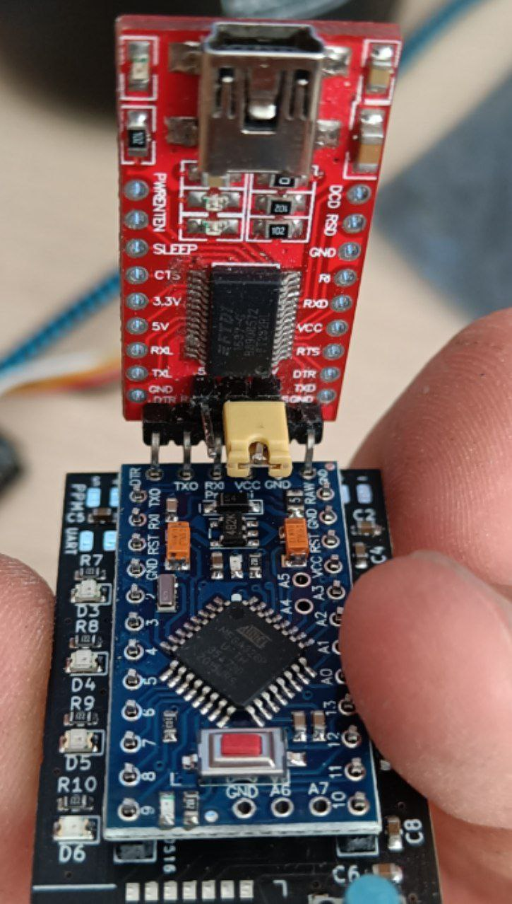

# Software configuration

## Download the Arduino software and required library

In order to do that, go to https://www.arduino.cc/en/software and get the appropriate version for your OS. Then, navigate to [this repo](https://github.com/StuartsProjects/SX12XX-LoRa) and download it as a `.zip` file:


Once you have it secured, import it in your arduino environment using the option `sketch->include library->add .zip library`


## Installing drivers for the USB-to-serial converter

If you're using windows, chances are you'll need to install [these drivers](https://ftdichip.com/drivers/)

## Configuring and flashing your transmitter

Download this repository using the same option you used to download the library. Once you have it unzipped, navigate to `software/tx`. The only file that should be modified in 99% of cases is `settings.h`. Configuration options are explained here:

```c
//#define DUAL_THROTTLE <- Uncomment this line if you're using a dual trigger case with 2 sensors.

// In case a dual trigger remote is used, the following line adjusts the sensitivity of the brakes, or in other words, when does the brake lever overrules the throttle. It is NOT recommended to lower it, but it can be raised to prevent accidental brake activation

#ifdef DUAL_THROTTLE
const float BRAKE_SENSITIVITY = 5; 
#endif

// Pairing: Choose a channel (0-40) and a transmitter identity (0-254) to prevent collisions with nearby remotes or other LoRa devices. These numbers must match the receiver's.

const unsigned int channel = -1;
const unsigned int TXIdentity = -1; 

// Battery levels: VREF is the actual internal reference of the Arduino, that can differ from one board to another. It can be adjusted here, increasing this number if the battery is reading high or decreasing it if it's reading low. It is strongly encouraged to use a multimeter to verify the actual values.

const unsigned long VREF = 1148566;

// Battery thresholds: Define what each LED of the remote means in terms of cell voltage, both for the remote and the board. First level is 4 LEDs ON, second one 3, etc. The last level will make the remote rumble and the last LED blink. WARNING: a maximum board voltage of 12S (50.4V) is measurable.

const float REMOTE_BATTERY_CELL_V_THR[] = { 4.0, 3.8, 3.7, 3.5, 3.3 };

const float BOARD_BATTERY_CELL_V_THR[] = { 4.0, 3.8, 3.7, 3.5, 3.3 };
const unsigned int BOARD_CELL_S = 12;

```

Once configured, connect the board to the usb adapter. The 328p based boards use this orientation with the jumper on the 3.3V position:



Select the appropriate board and port in the Arduino IDE:


And upload the code using the upload button (`sketch->upload`). 

## Calibration

If everything worked correctly, the remote should perform the startup routine (rumble + 4 LED on in sequence) and start the calibration routine (1 LED on). To calibrate the remote, follow these steps:

* Don't touch the thumbwheel/triggers to perform center detection. Click the button once.
* Second LED should light up. Push the thumbwheel/acceleration trigger to the maximum acceleration position and let it return to center. Click the button once.
* Third LED should light up. Push the thumbwheel/brake trigger to the maximum braking position and let it return to center. Click the button once.
* The fourth LED should light up and then all of them turn off. Calibration is complete.

After you're finished, it'll start to output debugging information through the serial port running at 115200 baud.

## Configuring and flashing the receiver

Similarly, the receiver has to be configured with matching pairing info:

```c
// Pairing: Choose a channel (0-40) and a transmitter identity (0-254) to prevent collisions with nearby remotes or other LoRa devices. These numbers must match the transmitter's.

const unsigned int channel = -1;
const unsigned int RXIdentity = -1; 

// Battery levels: VREF is the actual internal reference of the Arduino, that can differ from one board to another. It can be adjusted here, increasing this number if the battery is reading high or decreasing it if it's reading low. It is strongly encouraged to use a multimeter to verify the actual values.

const unsigned long VREF = 1148566;
```

And flashed taking into account the board type. Ff you're using a 168 equipped board, chose it accordingly in the IDE and make sure you connect the adapter correctly:


## Making sure it worked

Turn on the transmitter and connect the receiver to the USB adapter. Using the serial monitor, verify that the receiver is receiving approx. 50 throttle packages per second (usually 47-49) and is emitting 2 TM packages per second (some can be lost, is not a big deal).

## Connecting the receiver to the board

Depending on the ESC you're using the communications port can be arranged in a number of ways, but bear in mind the receiver requires 5V to work. If you want to have battery monitoring for your board in the remote, make sure to take a cable directly from the positive end of your battery and solder it to the VBAT pad in the receiver.

