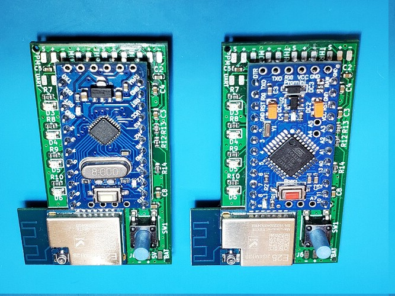

# Assembly

## Soldering the LoRa module

The first thing to do would be to solder the LoRa module in the appropriate spot. Using solder paste and a reflow station is recommended, but the footprint has slightly oversized pads so it can be done using a regular soldering iron. It should look like this:

## **IMPORTANT**

Some LoRa modules come with the external antenna selected, instead of the integrated one in the PCB. This WILL cause problems, increased sensitivity to interferences and dropouts. It is very important to make sure the resistor that selects the PCB antenna is in the correct position and move it otherwise:

## Soldering the Arduino

Make sure you have soldered the LoRa module first! While certainly possible to do the other way around, it is a lot easier to do it in this order. Using some pin headers (that should be included in the Arduino package), solder the Arduino to the PCB, making sure the orientation is correct (programming pins next to the top of the board where the throttle pads are) and A4/A5 pins are also soldered using a 2x1 pin header. These are only needed for the transmitter, but they don't hurt anyways. The transmitter *requires* a board equipped with the more powerful Atmega 328p processor, but the receiver can use the cheaper Atmega 168.

## **IMPORTANT** 

The reset button on both Arduinos **MUST** be removed. Nobody wants their remote to reset due to a bump or squeezing too hard.

## Completing the transmitter circuit

All the other components should be soldered to the appropriate pads. The connections are shown in this diagram (dotted lines mean optional)

